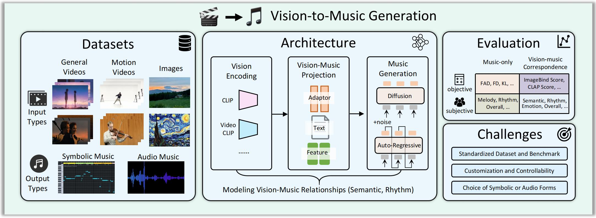
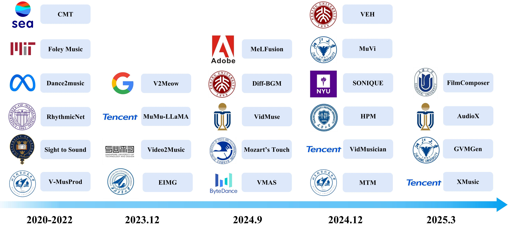

#   🎬 → 🎵 Awesome Vision-to-Music Generation

> [Vision-to-Music Generation: A Survey (ISMIR 2025)](https://arxiv.org/abs/2503.21254)
>
> Zhaokai Wang, Chenxi Bao, Le Zhuo, Jingrui Han, Yang Yue, Yihong Tang, Victor Shea-Jay Huang, Yue Liao

We provide a comprehensive survey on **vision-to-music generation *(V2M)***, including **video-to-music** and **image-to-music** generation. This survey aims to inspire further innovation in vision-to-music generation and the broader field of AI music generation in both academic research and industrial applications. In this repository, we have listed relevant papers related to methods, datasets, and evaluation of V2M. Notably, we list [demo links](#methods-general-videos-and-images) for all papers. This collection will be **continuously updated**. 



<div align="center">
  
</div>


## 📖 Table of Contents
- [Methods](#methods)
- [Datasets](#datasets)
- [Evaluation](#evaluation)
- [Full List](#full-list)
- [Contacts](#contacts)
- [Citation](#citation)


<a id="methods"></a>

## 🧩 V2M Methods

<a id="methods-general-videos-and-images"></a>
### 🔻 *General Videos and Images*

| Method         | Paper Link | Demo Link | Date    | Input Type           | Modality | Music Length | Vision-Music Relationships | Vision Encoding                                          | Vision-Music Projection | Music Generation          |
| -------------- | ---------- | --------- | ------- | -------------------- | -------- | ------------ | -------------------------- | -------------------------------------------------------- | ----------------------- | ------------------------- |
| CMT            |  [Paper](https://arxiv.org/pdf/2111.08380)          | [Demo](https://wzk1015.github.io/cmt/)          | 2021/11 | General Video        | Symbolic | 3min         | Rhythm                     | -                                                        | Elements                | AR (CP)                   |
| V-MusProd      |  [Paper](https://arxiv.org/pdf/2211.11248)          | [Demo](https://drive.google.com/drive/folders/1ASY44xqWGZgKkcHhpzWlOhIbUIMe_epQ) | 2022/11 | General Video        | Symbolic | 6min         | Semantics, Rhythm          | CLIP2Video, Histogan                                     | Feature                 | AR (CP)                   |
| V2Meow         |  [Paper](https://arxiv.org/abs/2305.06594)          | [Demo](https://google-research.github.io/noise2music/v2meow/) | 2023/05 | General Video        | Audio    | 10sec        | Semantics, Rhythm          | CLIP, I3D Flow, ViT-VQGAN                                | Feature                 | AR                        |
| MuMu-LLaMA     |  [Paper](https://arxiv.org/pdf/2412.06660)          | [Demo](https://crypto-code.github.io/MuMu-LLaMA_Demo/) | 2023/11 | General Video, Image | Audio    | 30sec        | Semantics                  | ViT, ViViT                                               | Adapter                 | AR (LLaMA2)               |
| Video2Music    |  [Paper](https://arxiv.org/pdf/2311.00968)          | [Demo](https://github.com/AMAAI-Lab/Video2Music?tab=readme-ov-file) | 2023/11 | General Video        | Symbolic | 5min         | Semantics, Rhythm          | CLIP                                                     | Feature                 | AR                        |
| EIMG           |  [Paper](https://ieeexplore.ieee.org/abstract/document/10345728)          | [Demo](https://github.com/zBaymax/EIMG)    | 2023/12 | Image                | Symbolic | 15sec        | Semantics                  | ALAE, β-VAE, VQ-VAE                                      | Adapter                 | VAE (FNT, LSR)            |
| Diff-BGM       |  [Paper](https://arxiv.org/pdf/2405.11913)          | [Demo](https://github.com/sizhelee/Diff-BGM/blob/master/video.mp4) | 2024/05 | General Video        | Symbolic | 5min         | Semantics                  | VideoCLIP                                                | Feature                 | Diff. (Polyffusion)       |
| Mozart's Touch |  [Paper](https://arxiv.org/pdf/2405.02801)          | [Demo](https://tiffanyblews.github.io/MozartsTouch-demo/) | 2024/05 | General Video, Image | Audio    | 10sec        | Semantics                  | BLIP                                                     | Text                    | AR (MusicGen)             |
| MeLFusion      |  [Paper](https://arxiv.org/pdf/2406.04673)          | [Demo](https://schowdhury671.github.io/melfusion_cvpr2024/) | 2024/06 | Image                | Audio    | 10sec        | Semantics                  | DDIM + T2I LDM                                           | Feature                 | Diff.                     |
| VidMuse        |  [Paper](https://arxiv.org/pdf/2406.04321)          | [Demo](https://vidmuse.github.io/) | 2024/06 | General Video        | Audio    | 20sec        | Semantics                  | CLIP                                                     | Adapter                 | AR (MusicGen)             |
| S2L2-V2M       |  [Paper](https://link.springer.com/article/10.1007/s00371-024-03606-w)          | [Demo](https://github.com/kai211233/S2L2-V2M) | 2024/08 | General Video        | Audio    | 10sec        | Semantics                  | Enhanced Video Mamba                                     | Adapter                 | AR (LLaMA2)               |
| VMAS           |  [Paper](https://arxiv.org/pdf/2409.07450)          | [Demo](https://genjib.github.io/project_page/VMAs/index.html) | 2024/09 | General Video        | Audio    | 10sec        | Semantics, Rhythm          | Hiera                                                    | Feature                 | AR                        |
| MuVi           |  [Paper](https://arxiv.org/pdf/2410.12957)          | [Demo](https://muvi-v2m.github.io/) | 2024/10 | General Video        | Audio    | 20sec        | Semantics, Rhythm          | VideoMAE V2                                              | Adapter                 | Diff. (DiT)               |
| SONIQUE        |  [Paper](https://arxiv.org/pdf/2410.03879)          | [Demo](https://zxxwxyyy.github.io/templates/sonique.html) | 2024/10 | General Video        | Audio    | 20sec        | Semantics, Rhythm          | Video-LLaMA, CLAP                                        | Text                    | Diff. (Stable Audio)      |
| VEH            |  [Paper](https://ieeexplore.ieee.org/abstract/document/10701611/)          |     -     | 2024/10 | General Video        | Symbolic | 30sec        | Semantics                  | VideoChat                                                | Text                    | AR (T5)                   |
| M2M-Gen        |  [Paper](https://arxiv.org/pdf/2410.09928)          | [Demo](https://manga-to-music.github.io/M2M-Gen/) | 2024/10 | Image (Manga)        | Audio    | 1min         | Semantics                  | CLIP, GPT-4                                              | Text                    | AR (MusicLM)              |
| HPM            |  [Paper](https://arxiv.org/pdf/2411.07539)          | [Demo](https://gujiuzean.github.io/HPM-web.github.io/) | 2024/11 | General Video        | Audio    | 10sec        | Semantics                  | CLIP, TAVAR, WECL                                        | Feature                 | Diff. (AudioLDM)          |
| VidMusician    |  [Paper](https://arxiv.org/pdf/2412.06296)          | [Demo](https://www.youtube.com/watch?v=EPOSXwtl1jw) | 2024/12 | General Video        | Audio    | 30sec        | Semantics, Rhythm          | CLIP, T5                                                 | Adapter                 | AR (MusicGen)             |
| MTM            |  [Paper](https://arxiv.org/pdf/2412.09428)          | [Demo](https://wzk1015.github.io/vmb/) | 2024/12 | General Video, Image | Audio    | 30sec        | Semantics                  | InternVL2                                                | Text                    | Diff. (Stable Audio Open) |
| XMusic         |  [Paper](https://arxiv.org/pdf/2501.08809)          | [Demo](https://xmusic-project.github.io/) | 2025/01 | General Video, Image | Symbolic | 20sec        | Semantics, Rhythm          | ResNet, CLIP                                             | Elements                | AR (CP)                   |
| GVMGen         |  [Paper](https://arxiv.org/pdf/2501.09972)          | [Demo](https://chouliuzuo.github.io/GVMGen/) | 2025/01 | General Video        | Audio    | 15sec        | Semantics                  | CLIP                                                     | Adapter                 | AR (MusicGen)             |
| AudioX         |  [Paper](https://arxiv.org/pdf/2503.10522)          | [Demo](https://zeyuet.github.io/AudioX/) | 2025/03 | General Video        | Audio    | 10sec        | Semantics                  | CLIP                                                     | Feature                 | Diff. (Stable Audio Open) |
| FilmComposer   |  [Paper](https://arxiv.org/pdf/2503.08147)          | [Demo](https://apple-jun.github.io/FilmComposer.github.io/) | 2025/03 | General Video        | Audio    | 15sec        | Semantics, Rhythm          | Controllable Rhythm Transformer, GPT-4v, Motion Detector | Text                    | AR (MusicGen)             |
| DyViM   |  [Paper](https://arxiv.org/pdf/2504.07594)          | - | 2025/04 | General Video        | Audio    | 10sec        | Semantics, Dynamics          | Optical flow, CLIP |  Adaptor, Cross-attention         | AR (MusicGen)             |


### 🔻 *Human Movement Videos*

| Method               | Paper Link                                                   | Demo Link                                                   | Date    | Input Type        | Modality | Music Length | Vision-Music Relationships | Vision Encoding        | Vision-Music Projection | Music Generation |
| -------------------- | ------------------------------------------------------------ | ----------------------------------------------------------- | ------- | ----------------- | -------- | ------------ | -------------------------- | ---------------------- | ----------------------- | ---------------- |
| Audeo                | [Paper](https://arxiv.org/pdf/2006.14348)                    | [Demo](https://faculty.washington.edu/shlizee/audeo/)       | 2020/06 | Performance Video | Symbolic | 30sec        | Rhythm                     | ResNet                 | Feature                 | GAN              |
| Foley Music          | [Paper](https://arxiv.org/pdf/2007.10984)                    | [Demo](http://foley-music.csail.mit.edu/)                   | 2020/07 | Performance Video | Symbolic | 10sec        | Rhythm                     | 2D Body Keypoints      | Feature                 | AR               |
| Multi-Instrument Net | [Paper](https://arxiv.org/pdf/2012.03478)                    | -                                                           | 2020/12 | Performance Video | Audio    | 10sec        | Rhythm                     | 2D Body Keypoints      | Feature                 | VAE              |
| RhythmicNet          | [Paper](https://proceedings.neurips.cc/paper_files/paper/2021/file/f4e369c0a468d3aeeda0593ba90b5e55-Paper.pdf) | [Demo](https://github.com/shlizee/RhythmicNet)              | 2021/06 | Dance Video       | Symbolic | 10sec        | Rhythm                     | 2D Body Keypoints      | Feature                 | AR (REMI)        |
| Dance2Music          | [Paper](https://arxiv.org/pdf/2107.06252)                    | [Demo](https://sites.google.com/view/dance2music/live-demo) | 2021/07 | Dance Video       | Symbolic | 12sec        | Rhythm                     | 2D Body Keypoints      | Feature                 | AR               |
| D2M-GAN              | [Paper](https://arxiv.org/pdf/2204.00604)                    | [Demo](https://l-yezhu.github.io/D2M-GAN/)                  | 2022/04 | Dance Video       | Audio    | 2sec         | Rhythm                     | 2D Body Keypoints, I3D | Feature                 | GAN              |
| CDCD                 | [Paper](https://arxiv.org/pdf/2206.07771)                    | [Demo](https://l-yezhu.github.io/CDCD/)                     | 2022/06 | Dance Video       | Audio    | 2sec         | Rhythm                     | 2D Body Keypoints, I3D | Feature                 | Diff.            |
| LORIS                | [Paper](https://arxiv.org/pdf/2305.01319)                    | [Demo](https://justinyuu.github.io/LORIS/)                  | 2023/05 | Movement Video    | Audio    | 50sec        | Rhythm                     | 2D Body Keypoints, I3D | Feature                 | Diff.            |
| VisBeatNet           | [Paper](https://openaccess.thecvf.com/content/WACV2024/papers/Liu_Let_the_Beat_Follow_You_-_Creating_Interactive_Drum_Sounds_WACV_2024_paper.pdf) | -                                                           | 2024/01 | Dance Video       | Symbolic | Realtime     | Rhythm                     | 2D Body Keypoints      | Feature                 | AR               |
| UniMuMo              | [Paper](https://arxiv.org/pdf/2410.04534)                    | [Demo](https://hanyangclarence.github.io/unimumo_demo/)     | 2024/10 | Dance Video       | Audio    | 10sec        | Rhythm                     | 2D Body Keypoints      | Feature                 | Diff.            |


<a id="datasets"></a>
## 🎬 V2M Datasets

### 🔻 *General Videos*

| Dataset     | Paper Link                                                   | Dataset Link                                                 | Date    | Source                             | Modality    | Size  | Total Length (hr) | Avg. Length (sec) | Annotations                                                  |
| ----------- | ------------------------------------------------------------ | ------------------------------------------------------------ | ------- | ---------------------------------- | ----------- | ----- | ----------------- | ----------------- | ------------------------------------------------------------ |
| HIMV-200K   | [Paper](https://arxiv.org/pdf/1704.06761)                    | [Link](https://github.com/csehong/VM-NET/tree/master/data)   | 2017/04 | Music Video (Youtube-8M)           | Audio       | 200K  | -                 | -                 | -                                                            |
| MVED        | [Paper](https://dl.acm.org/doi/abs/10.1007/s11042-020-08836-3) | [Link](https://github.com/yagyapandeya/Music_Video_Emotion_Dataset) | 2020/09 | Music Video                        | Audio       | 1.9K  | 16.5              | 30                | Emotion                                                      |
| SymMV       | [Paper](https://arxiv.org/pdf/2211.11248)                    | [Link](https://github.com/zhuole1025/SymMV/tree/main/dataset) | 2022/11 | Music Video                        | MIDI, Audio | 1.1K  | 76.5              | 241               | Lyrics, Genre, Chord, Melody, Tonality, Beat                 |
| MV100K      | [Paper](https://arxiv.org/pdf/2305.06594)                    | -                                                            | 2023/05 | Music Video (Youtube-8M)           | Audio       | 110K  | 5000              | 163               | Genre                                                        |
| MusicCaps   | [Paper](https://arxiv.org/pdf/2301.11325)                    | [Link](https://www.kaggle.com/datasets/googleai/musiccaps)   | 2023/01 | Diverse Videos (AudioSet)          | Audio       | 5.5K  | 15.3              | 10                | Genre, Caption, Emotion, Tempo, Instrument, ...              |
| EmoMV       | [Paper](https://dl.acm.org/doi/abs/10.1016/j.inffus.2022.10.002) | [Link](https://github.com/ivyha010/EmoMV)                    | 2023/03 | Music Video (MVED, AudioSet)       | Audio       | 6K    | 44.3              | 27                | Emotion                                                      |
| MUVideo     | [Paper](https://arxiv.org/pdf/2412.06660)                    | [Link](https://huggingface.co/datasets/M2UGen/MUVideo)       | 2023/11 | Diverse Videos (Balanced-AudioSet) | Audio       | 14.5K | 40.3              | 10                | Instructions                                                 |
| MuVi-Sync   | [Paper](https://arxiv.org/pdf/2311.00968)                    | [Link](https://zenodo.org/records/10057093)                  | 2023/11 | Music Video                        | MIDI, Audio | 784   | -                 | -                 | Scene Offset, Emotion, Motion, Semantic, Chord, Key, Loudness, Density, ... |
| BGM909      | [Paper](https://arxiv.org/pdf/2405.11913)                    | [Link](https://github.com/sizhelee/Diff-BGM)                 | 2024/05 | Music Video                        | MIDI        | 909   | -                 | -                 | Caption, Style, Chord, Melody, Beat, Shot                    |
| V2M         | [Paper](https://arxiv.org/pdf/2406.04321)                    | -                                                            | 2024/06 | Diverse Videos                     | Audio       | 360K  | 18000             | 180               | Genre                                                        |
| DISCO-MV    | [Paper](https://arxiv.org/pdf/2409.07450)                    | -                                                            | 2024/09 | Music Video (DISCO-10M)            | Audio       | 2200K | 47000             | 77                | Genre                                                        |
| FilmScoreDB | [Paper](https://arxiv.org/pdf/2411.07539)                    | -                                                            | 2024/11 | Film Video                         | Audio       | 32K   | 90.3              | 10                | Movie Title                                                  |
| DVMSet      | [Paper](https://arxiv.org/pdf/2412.06296)                    | -                                                            | 2024/12 | Diverse Videos                     | Audio       | 3.8K  | -                 | -                 | -                                                            |
| HarmonySet  | [Paper](https://arxiv.org/pdf/2503.01725)                    | [Link](https://huggingface.co/datasets/Zzitang/HarmonySet)   | 2025/03 | Diverse Videos                     | Audio       | 48K   | 458.8             | 32                | Description                                                  |
| MusicPro-7k | [Paper](https://arxiv.org/pdf/2503.08147)                    | [Link](https://huggingface.co/datasets/apple-jun/MusicPro-7k) | 2025/03 | Film Video                         | Audio       | 7K    | -                 | -                 | Description, Melody, Rhythm Spots                            |

### 🔻 *Human Movement Videos*

| Dataset            | Paper Link                                | Dataset Link                                                 | Date    | Source                                  | Modality    | Size | Total Length (hr) | Avg. Length (sec) | Annotations |
| ------------------ | ----------------------------------------- | ------------------------------------------------------------ | ------- | --------------------------------------- | ----------- | ---- | ----------------- | ----------------- | ----------- |
| URMP               | [Paper](https://arxiv.org/pdf/1612.08727) | [Link](https://datadryad.org/stash/dataset/doi:10.5061/dryad.ng3r749) | 2016/12 | Performance Video                       | MIDI, Audio | 44   | 1.3               | 106               | Instruments |
| MUSIC              | [Paper](https://arxiv.org/pdf/1804.03160) | [Link](https://github.com/roudimit/MUSIC_dataset)            | 2018/04 | Performance Video                       | Audio       | 685  | 45.7              | 239               | Instruments |
| AIST++             | [Paper](https://arxiv.org/pdf/2101.08779) | [Link](https://google.github.io/aistplusplus_dataset/download.html) | 2021/01 | Dance Video (AIST)                      | Audio       | 1.4K | 5.2               | 13                | 3D Motion   |
| TikTok Dance-Music | [Paper](https://arxiv.org/pdf/2204.00604) | [Link](https://github.com/L-YeZhu/D2M-GAN)                   | 2022/04 | Dance Video                             | Audio       | 445  | 1.5               | 12                | -           |
| LORIS              | [Paper](https://arxiv.org/pdf/2305.01319) | [Link](https://huggingface.co/datasets/OpenGVLab/LORIS)      | 2023/05 | Dance/Sports Video (AIST, FisV, FS1000) | Audio       | 16K  | 86.43             | 19                | 2D Pose     |

### 🔻 *Images*

| Dataset     | Paper Link                                                   | Dataset Link                                                | Date    | Source                    | Modality | Size  | Total Length (min) | Avg. Length (sec) | Annotations    |
| ----------- | ------------------------------------------------------------ | ----------------------------------------------------------- | ------- | ------------------------- | -------- | ----- | ------------------ | ----------------- | -------------- |
| Music-Image | [Paper](https://ieeexplore.ieee.org/abstract/document/7457690) | [Link](https://mmlab.siat.ac.cn/musicimage_matching/index)  | 2016/07 | Image (Music Video)       | Audio    | 22.6K | 377                | 60                | Lyrics         |
| Shuttersong | [Paper](https://arxiv.org/pdf/1708.05851)                    | [Link](https://dtaoo.github.io/dataset.html)                | 2017/08 | Image (Shuttersong App)   | Audio    | 586   | -                  | -                 | Lyrics         |
| IMAC        | [Paper](https://arxiv.org/pdf/1904.00150)                    | [Link](https://gaurav22verma.github.io/IMAC_Dataset.html)   | 2019/04 | Image (FI)                | Audio    | 3.8K  | 63.3               | 60                | Emotion        |
| MUImage     | [Paper](https://arxiv.org/pdf/2412.06660)                    | [Link](https://huggingface.co/datasets/M2UGen/MUImage)      | 2023/11 | Image (Balanced-AudioSet) | Audio    | 14.5K | 40.3               | 10                | Instructions   |
| EIMG        | [Paper](https://ieeexplore.ieee.org/abstract/document/10345728) | [Link](https://github.com/zBaymax/EIMG)                     | 2023/12 | Image (IAPS, NAPS)        | MIDI     | 3K    | 12.5               | 15                | VA Value       |
| MeLBench    | [Paper](https://arxiv.org/pdf/2406.04673)                    | [Link](https://schowdhury671.github.io/melfusion_cvpr2024/) | 2024/06 | Image (Diverse Videos)    | Audio    | 11.2K | 31.2               | 10                | Genre, Caption |


<a id="evaluation"></a>

## 📊 V2M Evaluation

### 🎯 Objective Metrics

#### 🔻 *Music-only*

| Metric                           | Modality | Type     |
| -------------------------------- | -------- | -------- |
| Scale Consistency                | MIDI     | Pitch    |
| Pitch Entropy                    | MIDI     | Pitch    |
| Pitch Class Histogram Entropy    | MIDI     | Pitch    |
| Empty Beat Rate                  | MIDI     | Rhythm   |
| Average Inter-Onset Interval     | MIDI     | Rhythm   |
| Grooving Pattern Similarity      | MIDI     | Rhythm   |
| Structure Indicator              | MIDI     | Rhythm   |
| Frechet Audio Distance (FAD)     | Audio    | Fidelity |
| Frechet Distance (FD)            | Audio    | Fidelity |
| Kullback-Leibler Divergence (KL) | Audio    | Fidelity |
| Beats Coverage Score (BCS)       | Audio    | Rhythm   |
| Beats Hit Score (BHS)            | Audio    | Rhythm   |
| Inception Score (IS)             | Audio    | Fidelity |

#### 🔻 *Vision-Music Correspondence*

| Metric                            | Modality           | Type     |
| --------------------------------- | ------------------ | -------- |
| ImageBind Score / Rank            | Audio, Video/Image | Semantic |
| CLAP Score                        | Audio, Audio/Text  | Semantic |
| Video-Music CLIP Precision (VMCP) | Audio, Video       | Semantic |
| Video-Music Correspondence        | Audio, Video       | Semantic |
| Cross-modal Relevance             | Audio, Video       | Semantic |
| Temporal Alignment                | Audio, Video       | Rhythmic |
| Rhythm Alignment                  | Audio, Video       | Rhythmic |


### 🎧 Subjective Metrics

#### 🔻 *Music-only*


| Metric                |
|------------------------|
| Music Melody           |
| Music Rhythm           |
| Music Richness         |
| Audio Quality          |
| Overall Music Quality  |

#### 🔻 *Vision-Music Correspondence*

| Metric                 |
|------------------------|
| Semantic Consistency   |
| Rhythm Consistency     |
| Emotion Consistency    |
| Overall Correspondence |


<a id="full-list"></a>

## 📚 Full List

1. [2016/07] [TMM 2016] Bridging Music and Image via Cross-Modal Ranking Analysis [[paper](https://ieeexplore.ieee.org/abstract/document/7457690)]

2. [2016/12] [TMM 2018] Creating A Multi-track Classical Music Performance Dataset for Multi-modal Music Analysis: Challenges, Insights, and Applications [[paper](https://arxiv.org/pdf/1612.08727)]

3. [2017/04] [ICMR 2018] Content-Based Video–Music Retrieval Using Soft Intra-Modal Structure Constraint [[paper](https://arxiv.org/pdf/1704.06761)]

4. [2017/08] [ICCV 2017] Image2song: Song Retrieval via Bridging Image Content and Lyric Words [[paper](https://arxiv.org/pdf/1708.05851)]

5. [2018/04] [ECCV 2018] The Sound of Pixels [[paper](https://arxiv.org/pdf/1804.03160)]

6. [2019/04] [ICASSP 2019] Learning Affective Correspondence between Music and Image [[paper](https://arxiv.org/pdf/1904.00150)]

7. [2020/04] [ICASSP 2020] Sight to Sound: An End-to-End Approach for Visual Piano Transcription [[paper]](https://ieeexplore.ieee.org/abstract/document/9053115)

8. [2020/06] [NeurIPS 2020] Audeo: Audio Generation for a Silent Performance Video [[paper](https://arxiv.org/pdf/2006.14348)]

9. [2020/07] [ECCV 2020] Foley Music: Learning to Generate Music from Videos [[paper](https://arxiv.org/pdf/2007.10984)]

10. [2020/07] [ICCC 2020] Automated Music Generation for Visual Art through Emotion [[paper]][https://computationalcreativity.net/iccc20/papers/137-iccc20.pdf]

11. [2020/09] [Multimedia Tools and Applications 2021] Deep learning-based late fusion of multimodal information for emotion classification of music video [[paper](https://dl.acm.org/doi/abs/10.1007/s11042-020-08836-3)]

12. [2020/12] Multi-Instrumentalist Net: Unsupervised Generation of Music from Body Movements [[paper](https://arxiv.org/pdf/2012.03478)]

13. [2021/06] [NeurIPS 2021] How Does it Sound? Generation of Rhythmic Soundtracks for Human Movement Videos [[paper](https://proceedings.neurips.cc/paper_files/paper/2021/file/f4e369c0a468d3aeeda0593ba90b5e55-Paper.pdf)]

14. [2021/07] Dance2Music: Automatic Dance-driven Music Generation [[paper](https://arxiv.org/pdf/2107.06252)]

15. [2021/07] [ICCC 2021] MuSyFI - Music Synthesis From Images [[paper]](https://computationalcreativity.net/iccc21/wp-content/uploads/2021/09/ICCC_2021_paper_40.pdf)

16. [2021/11] [ACMMM 2021] Video Background Music Generation with Controllable Music Transformer [[paper](https://arxiv.org/pdf/2111.08380)]

17. [2021/12] InverseMV: Composing Piano Scores with a Convolutional Video-Music Transformer [[paper]](https://arxiv.org/pdf/2112.15320)

18. [2021/12] [GCCE 2021] Semi-automatic music piece creation based on impression words extracted from object and background in color image [[paper]](https://ieeexplore.ieee.org/abstract/document/9622004)

19. [2022/04] [ECCV 2022] Quantized GAN for Complex Music Generation from Dance Videos [[paper](https://arxiv.org/pdf/2204.00604)]

20. [2022/05] [Applied Science 2022] Double Linear Transformer for Background Music Generation from Videos [[paper]](https://www.mdpi.com/2076-3417/12/10/5050)

21. [2022/06] [ICLR 2023] Discrete Contrastive Diffusion for Crossmodal Music and Image Generation [[paper](https://arxiv.org/pdf/2206.07771)]

22. [2022/11] [ICCV 2023] Video Background Music Generation: Dataset, Method and Evaluation [[paper](https://arxiv.org/pdf/2211.11248)]

23. [2022/11] Vis2Mus: Exploring Multimodal Representation Mapping for Controllable Music Generation [[paper]](https://arxiv.org/pdf/2211.05543)

24. [2023/01] MusicLM: Generating Music From Text [[paper](https://arxiv.org/pdf/2301.11325)]

25. [2023/01] [ISM 2022] Retaining Semantics in Image to Music Conversion [[paper]](https://ieeexplore.ieee.org/abstract/document/10019705)

26. [2023/01] [Computational Visual Media 2024] Dance2MIDI: Dance-driven multi-instruments music generation [[paper]](https://arxiv.org/pdf/2301.09080)

27. [2023/03] [Information Fusion 2023] EmoMV: Affective music-video correspondence learning datasets for classification and retrieval [[paper](https://dl.acm.org/doi/abs/10.1016/j.inffus.2022.10.002)]

28. [2023/05] [AAAI 2024] V2Meow: Meowing to the Visual Beat via Video-to-Music Generation [[paper](https://arxiv.org/abs/2305.06594)]

29. [2023/05] [ICML 2023] Long-Term Rhythmic Video Soundtracker [[paper](https://arxiv.org/pdf/2305.01319)]

30. [2023/11] MuMu-LLaMA: Multi-modal Music Understanding and Generation via Large Language Models [[paper](https://arxiv.org/pdf/2412.06660)]

31. [2023/11] [Expert Systems with Applications 2024] Video2Music: Suitable Music Generation from Videos using an Affective Multimodal Transformer model [[paper](https://arxiv.org/pdf/2311.00968)]

32. [2023/11] [SIGGRAPH Asia 2023] Motion to Dance Music Generation using Latent Diffusion Model [[paper]](https://dl.acm.org/doi/abs/10.1145/3610543.3626164)

33. [2023/12] [TMM 2023] Continuous Emotion-Based Image-to-Music Generation [[paper](https://ieeexplore.ieee.org/abstract/document/10345728)]

34. [2023/12] CMMD: Contrastive Multi-Modal Diffusion for Video-Audio Conditional Modeling [[paper]](https://arxiv.org/pdf/2312.05412)

35. [2024/01] [WACV 2024] Let the Beat Follow You - Creating Interactive Drum Sounds From Body Rhy [[paper](https://openaccess.thecvf.com/content/WACV2024/papers/Liu_Let_the_Beat_Follow_You_-_Creating_Interactive_Drum_Sounds_WACV_2024_paper.pdf)]

36. [2024/01] [SIGGRAPH Asia 2024] Dance-to-Music Generation with Encoder-based Textual Inversion [[paper]](https://arxiv.org/abs/2401.17800)

37. [2024/05] [CVPR 2024] Diff-BGM: A Diffusion Model for Video Background Music Generation [[paper](https://arxiv.org/pdf/2405.11913)]

38. [2024/05] [NeurIPS 2024] M3GPT: An Advanced Multimodal, Multitask Framework for Motion Comprehension and Generation [[paper]](https://arxiv.org/pdf/2405.16273)

39. [2024/05] [TMM 2024] DanceComposer: Dance-to-Music Generation Using a Progressive Conditional Music Generator [[paper]](https://ieeexplore.ieee.org/abstract/document/10539267)

40. [2024/05] Mozart’s Touch: A Lightweight Multi-modal Music Generation Framework Based on Pre-Trained Large Models [[paper](https://arxiv.org/pdf/2405.02801)]

41. [2024/06] [CVPR 2024] MeLFusion: Synthesizing Music from Image and Language Cues using Diffusion Models [[paper](https://arxiv.org/pdf/2406.04673)]

42. [2024/06] [CVPR 2025] VidMuse: A Simple Video-to-Music Generation Framework with Long-Short-Term Modeling [[paper](https://arxiv.org/pdf/2406.04321)]

43. [2024/07] [ICMEW 2024] Popular Hooks: A Multimodal Dataset of Musical Hooks for Music Understanding and Generation [[paper]](https://ieeexplore.ieee.org/abstract/document/10645427)

44. [2024/07] [Array 2024] D2MNet for music generation joint driven by facial expressions and dance movements [[paper]](https://www.sciencedirect.com/science/article/pii/S2590005624000146)

45. [2024/07] MMTrail: A Multimodal Trailer Video Dataset with Language and Music Descriptions [[paper]](https://arxiv.org/pdf/2407.20962)

46. [2024/08] [The Visual Computer 2024] Video-driven musical composition using large language model with memory-augmented state spac [[paper](https://link.springer.com/article/10.1007/s00371-024-03606-w)]

47. [2024/09] [WACV 2025] VMAS: Video-to-Music Generation via Semantic Alignment in Web Music Videos [[paper](https://arxiv.org/pdf/2409.07450)]

48. [2024/09] [EURASIP Journal on Audio, Speech, and Music Processing] Dance2Music-Diffusion: leveraging latent diffusion models for music generation from dance videos [[paper]](https://dl.acm.org/doi/abs/10.1186/s13636-024-00370-6)

49. [2024/10] MuVi: Video-to-Music Generation with Semantic Alignment and Rhythmic Synchronization [[paper](https://arxiv.org/pdf/2410.12957)]

50. [2024/10] [ICASSP 2025] SONIQUE: Video Background Music Generation Using Unpaired Audio-Visual Data [[paper](https://arxiv.org/pdf/2410.03879)]

51. [2024/10] [TCSS 2024] Video Echoed in Harmony: Learning and Sampling Video-Integrated Chord Progression Sequences for Controllable Video Background Music [[paper](https://ieeexplore.ieee.org/abstract/document/10701611/)]

52. [2024/10] [TII 2025] Application and Research of Music Generation System Based on CVAE and Transformer-XL in Video Background Music [[paper]](https://ieeexplore.ieee.org/abstract/document/10729273)

53. [2024/10] M2M-Gen: A Multimodal Framework for Automated Background Music Generation in Japanese Manga Using Large Language Models [[paper](https://arxiv.org/pdf/2410.09928)]

54. [2024/10] UniMuMo: Unified Text, Music and Motion Generation [[paper](https://arxiv.org/pdf/2410.04534)]

55. [2024/11] Harmonizing Pixels and Melodies: Maestro-Guided Film Score Generation and Composition Style Transfer [[paper](https://arxiv.org/pdf/2411.07539)]

56. [2024/11] [NeurIPS 2024] MoMu-Diffusion: On Learning Long-Term Motion-Music Synchronization and Correspondence [[paper]](https://arxiv.org/pdf/2411.01805)

57. [2024/12] VidMusician: Video-to-Music Generation with Semantic-Rhythmic Alignment via Hierarchical Visual Features [[paper](https://arxiv.org/pdf/2412.06296)]

58. [2024/12] Multimodal Music Generation with Explicit Bridges and Retrieval Augmentation [[paper](https://arxiv.org/pdf/2412.09428)]

59. [2025/01] XMusic: Towards a Generalized and Controllable Symbolic Music Generation Framework [[paper](https://arxiv.org/pdf/2501.08809)]

60. [2025/01] GVMGen: A General Video-to-Music Generation Model with Hierarchical Attentions [[paper](https://arxiv.org/pdf/2501.09972)]

61. [2025/03] AudioX: Diffusion Transformer for Anything-to-Audio Generation [[paper](https://arxiv.org/pdf/2503.10522)]

62. [2025/03] [CVPR 2025] FilmComposer: LLM-Driven Music Production for Silent Film Clips [[paper](https://arxiv.org/pdf/2503.08147)]

63. [2025/03] [CVPR 2025] HarmonySet: A Comprehensive Dataset for Understanding Video-Music Semantic Alignment and Temporal Synchronization [[paper](https://arxiv.org/pdf/2503.01725)]

64. [2025/04] Extending Visual Dynamics for Video-to-Music Generation [[paper](https://arxiv.org/pdf/2504.07594)]

    

<a id="contacts"></a>

## ✉️ Contacts
The repo is being updated actively🚀. Please let us know if you notice any mistakes or would like any work to be included in our list through [GitHub pull requests](https://github.com/wzk1015/Awesome-Vision-to-Music-Generation/pulls) or e-mail: wangzhaokai@sjtu.edu.cn.


<a id="citation"></a>

## 📎 Citation

If you find our work valuable for your research or applications, we would greatly appreciate a star ⭐ and a citation using the BibTeX entry provided below.
```
@article{Wang2025VisionToMusic,
  title={Vision-to-Music Generation: A Survey},
  author={Wang, Zhaokai and Bao, Chenxi and Zhuo, Le and Han, Jingrui and Yue, Yang and Tang, Yihong and Huang, Victor Shea-Jay and Liao, Yue},
  journal={arXiv preprint arXiv:2503.21254},
  year={2025}
}
```

