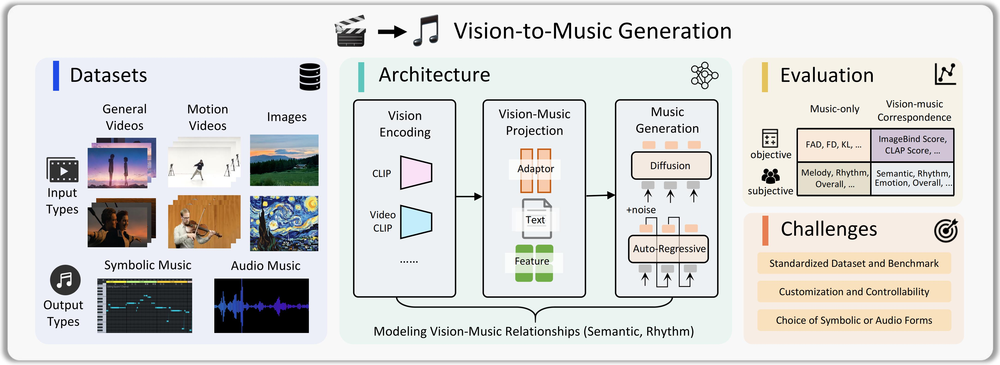

<!--<h1 align="center">

  🎬 → 🎵
Awesome Vision-to-Music Generation
</h1> -->


#   🎬 → 🎵 Awesome Vision-to-Music Generation


<p align="center">
  <a href="http"><b>[📜 Paper]</b></a>
  <br>
</p>

This is the repo for the paper "[A Survey on Video-to-music and Image-to-music Generation: Methods, Datasets, and Challenges](http)". This paper conducts a comprehensive survey on **vision-to-music generation *(V2M)***, including **video-to-music generation** and **image-to-music generation**. This survey aims to inspire further innovation in vision-to-music generation and the broader field of AI music generation in both academic research and industrial applications. In this repository, we have listed relevant papers related to **Methods**, **Datasets**, and **Evaluation** of V2M. This collection will be **continuously updated**. We aim to provide you with comprehensive knowledge in the V2M field, hoping it can help you quickly familiarize yourself with this research direction.

  
  


## Table of Contents
- [Tables](#tables)
  - [Methods](#v2m-methods)
  - [Datasets](#v2m-datasets)
  - [Evaluation](#v2m-evaluation)
- [Full List](#full-list)
- [Contact](#contact)
- [Citation](#citation)


## Tables

### V2M Methods

TODO (also add demo link)


### V2M Datasets

#### 🔻 *General Videos*

| Dataset     | Paper Link                       | Dataset Link                                                 | Date    | Source                             | Modality    | Size  | Total Length (hr) | Avg. Length (sec) | Annotations                                                  |
| ----------- | -------------------------------- | ------------------------------------------------------------ | ------- | ---------------------------------- | ----------- | ----- | ----------------- | ----------------- | ------------------------------------------------------------ |
| HIMV-200K   | [Paper](https://arxiv.org/pdf/1704.06761) | [Link](https://github.com/csehong/VM-NET/tree/master/data)   | 2017.4  | Music Video (Youtube-8M)           | Audio       | 200K  | -                 | -                 | -                                                            |
| MVED        |  [Paper](https://dl.acm.org/doi/abs/10.1007/s11042-020-08836-3) | [Link](https://github.com/yagyapandeya/Music_Video_Emotion_Dataset) | 2020.9  | Music Video                        | Audio       | 1.9K  | 16.5              | 30                | Emotion                                                      |
| SymMV       |    [Paper](https://arxiv.org/pdf/2211.11248)                              | [Link](https://github.com/zhuole1025/SymMV/tree/main/dataset) | 2022.11 | Music Video                        | MIDI, Audio | 1.1K  | 76.5              | 241               | Lyrics, Genre, Chord, Melody, Tonality, Beat                 |
| MV100K      |   [Paper](https://arxiv.org/pdf/2305.06594)                               | -                                                            | 2023.5  | Music Video (Youtube-8M)           | Audio       | 110K  | 5000              | 163               | Genre                                                        |
| MusicCaps   |   [Paper](https://arxiv.org/pdf/2301.11325)                               | [Link](https://www.kaggle.com/datasets/googleai/musiccaps)   | 2023.1  | Diverse Videos (AudioSet)          | Audio       | 5.5K  | 15.3              | 10                | Genre, Caption, Emotion, Tempo, Instrument, ...              |
| EmoMV       |   [Paper](https://dl.acm.org/doi/abs/10.1016/j.inffus.2022.10.002)                               | [Link](https://github.com/ivyha010/EmoMV)                    | 2023.3  | Music Video (MVED, AudioSet)       | Audio       | 6K    | 44.3              | 27                | Emotion                                                      |
| MUVideo     |   [Paper](https://arxiv.org/pdf/2412.06660)                               | [Link](https://huggingface.co/datasets/M2UGen/MUVideo)       | 2023.11 | Diverse Videos (Balanced-AudioSet) | Audio       | 14.5K | 40.3              | 10                | Instructions                                                 |
| MuVi-Sync   |   [Paper](https://arxiv.org/pdf/2311.00968)                               | [Link](https://zenodo.org/records/10057093)                  | 2023.11 | Music Video                        | MIDI, Audio | 784   | -                 | -                 | Scene Offset, Emotion, Motion, Semantic, Chord, Key, Loudness, Density, ... |
| BGM909      |   [Paper](https://arxiv.org/pdf/2405.11913)                               | [Link](https://github.com/sizhelee/Diff-BGM)                 | 2024.5  | Music Video                        | MIDI        | 909   | -                 | -                 | Caption, Style, Chord, Melody, Beat, Shot                    |
| V2M         |   [Paper](https://arxiv.org/pdf/2406.04321)                               | -                                                            | 2024.6  | Diverse Videos                     | Audio       | 360K  | 18000             | 180               | Genre                                                        |
| DISCO-MV    |   [Paper](https://arxiv.org/pdf/2409.07450)                               | -                                                            | 2024.9  | Music Video (DISCO-10M)            | Audio       | 2200K | 47000             | 77                | Genre                                                        |
| FilmScoreDB |   [Paper](https://arxiv.org/pdf/2411.07539)                               | -                                                            | 2024.11 | Film Video                         | Audio       | 32K   | 90.3              | 10                | Movie Title                                                  |
| DVMSet      |   [Paper](https://arxiv.org/pdf/2412.06296)                               | -                                                            | 2024.12 | Diverse Videos                     | Audio       | 3.8K  | -                 | -                 | -                                                            |
| HarmonySet  |   [Paper](https://arxiv.org/pdf/2503.01725)                               | [Link](https://huggingface.co/datasets/Zzitang/HarmonySet)   | 2025.3  | Diverse Videos                     | Audio       | 48K   | 458.8             | 32                | Description                                                  |
| MusicPro-7k |   [Paper](https://arxiv.org/pdf/2503.08147)                              | [Link](https://huggingface.co/datasets/apple-jun/MusicPro-7k) | 2025.3  | Film Video                         | Audio       | 7K    | -                 | -                 | Description, Melody, Rhythm Spots                            |

#### 🔻 *Human Movement Videos*

| Dataset            | Paper Link | Dataset Link                                                 | Date    | Source                                  | Modality    | Size | Total Length (hr) | Avg. Length (sec) | Annotations |
| ------------------ | ---------- | ------------------------------------------------------------ | ------- | --------------------------------------- | ----------- | ---- | ----------------- | ----------------- | ----------- |
| URMP               | [Paper](https://arxiv.org/pdf/1612.08727)           | [Link](https://datadryad.org/stash/dataset/doi:10.5061/dryad.ng3r749) | 2016.12 | Performance Video                       | MIDI, Audio | 44   | 1.3               | 106               | Instruments |
| MUSIC              | [Paper](https://arxiv.org/pdf/1804.03160)           | [Link](https://github.com/roudimit/MUSIC_dataset)            | 2018.4  | Performance Video                       | Audio       | 685  | 45.7              | 239               | Instruments |
| AIST++             | [Paper](https://arxiv.org/pdf/2101.08779)           | [Link](https://google.github.io/aistplusplus_dataset/download.html) | 2021.1  | Dance Video (AIST)                      | Audio       | 1.4K | 5.2               | 13                | 3D Motion   |
| TikTok Dance-Music | [Paper](https://arxiv.org/pdf/2204.00604)           | [Link](https://github.com/L-YeZhu/D2M-GAN)                   | 2022.4  | Dance Video                             | Audio       | 445  | 1.5               | 12                | -           |
| LORIS              | [Paper](https://arxiv.org/pdf/2305.01319)           | [Link](https://huggingface.co/datasets/OpenGVLab/LORIS)      | 2023.5  | Dance/Sports Video (AIST, FisV, FS1000) | Audio       | 16K  | 86.43             | 19                | 2D Pose     |

#### 🔻 *Images*

| Dataset     | Paper Link | Dataset Link                                                | Date    | Source                    | Modality | Size  | Total Length (min) | Avg. Length (sec) | Annotations    |
| ----------- | ---------- | ----------------------------------------------------------- | ------- | ------------------------- | -------- | ----- | ------------------ | ----------------- | -------------- |
| Music-Image |  [Paper](https://ieeexplore.ieee.org/abstract/document/7457690)          | [Link](https://mmlab.siat.ac.cn/musicimage_matching/index)  | 2016.7  | Image (Music Video)       | Audio    | 22.6K | 377                | 60                | Lyrics         |
| Shuttersong | [Paper](https://arxiv.org/pdf/1708.05851)           | [Link](https://dtaoo.github.io/dataset.html)                | 2017.8  | Image (Shuttersong App)   | Audio    | 586   | -                  | -                 | Lyrics         |
| IMAC        |  [Paper](https://arxiv.org/pdf/1904.00150)          | [Link](https://gaurav22verma.github.io/IMAC_Dataset.html)   | 2019.4  | Image (FI)                | Audio    | 3.8K  | 63.3               | 60                | Emotion        |
| MUImage     |  [Paper](https://arxiv.org/pdf/2412.06660)          | [Link](https://huggingface.co/datasets/M2UGen/MUImage)      | 2023.11 | Image (Balanced-AudioSet) | Audio    | 14.5K | 40.3               | 10                | Instructions   |
| EIMG        |  [Paper](https://ieeexplore.ieee.org/abstract/document/10345728)          | [Link](https://github.com/zBaymax/EIMG)                     | 2023.12 | Image (IAPS, NAPS)        | MIDI     | 3K    | 12.5               | 15                | VA Value       |
| MeLBench    |  [Paper](https://arxiv.org/pdf/2406.04673)          | [Link](https://schowdhury671.github.io/melfusion_cvpr2024/) | 2024.6  | Image (Diverse Videos)    | Audio    | 11.2K | 31.2               | 10                | Genre, Caption |


## V2M Evaluation

### 🎯 Objective Metrics

#### 🔻 *Music-only*

| Metric                           | Modality | Type     |
| -------------------------------- | -------- | -------- |
| Scale Consistency                | MIDI     | Pitch    |
| Pitch Entropy                    | MIDI     | Pitch    |
| Pitch Class Histogram Entropy    | MIDI     | Pitch    |
| Empty Beat Rate                  | MIDI     | Rhythm   |
| Average Inter-Onset Interval     | MIDI     | Rhythm   |
| Grooving Pattern Similarity      | MIDI     | Rhythm   |
| Structure Indicator              | MIDI     | Rhythm   |
| Frechet Audio Distance (FAD)     | Audio    | Fidelity |
| Frechet Distance (FD)            | Audio    | Fidelity |
| Kullback-Leibler Divergence (KL) | Audio    | Fidelity |
| Beats Coverage Score (BCS)       | Audio    | Rhythm   |
| Beats Hit Score (BHS)            | Audio    | Rhythm   |
| Inception Score (IS)             | Audio    | Fidelity |

#### 🔻 *Vision-Music Correspondence*

| Metric                            | Modality           | Type     |
| --------------------------------- | ------------------ | -------- |
| ImageBind Score / Rank            | Audio, Video/Image | Semantic |
| CLAP Score                        | Audio, Audio/Text  | Semantic |
| Video-Music CLIP Precision (VMCP) | Audio, Video       | Semantic |
| Video-Music Correspondence        | Audio, Video       | Semantic |
| Cross-modal Relevance             | Audio, Video       | Semantic |
| Temporal Alignment                | Audio, Video       | Rhythmic |
| Rhythm Alignment                  | Audio, Video       | Rhythmic |


### 🎧 Subjective Metrics

#### 🔻 *Music-only*


| Metric                |
|------------------------|
| Music Melody           |
| Music Rhythm           |
| Music Richness         |
| Audio Quality          |
| Overall Music Quality  |

#### 🔻 *Vision-Music Correspondence*

| Metric                 |
|------------------------|
| Semantic Consistency   |
| Rhythm Consistency     |
| Emotion Consistency    |
| Overall Correspondence |


## Full List

TODO (convert from tables with GPT)

1. [2024/12] Title [[paper](https://arxiv.org/abs/2412.01268)]
2. 


## Contacts
The repo is still being updated actively🚀. Please let us know if you notice any mistakes or would like any work to be included in our list through [GitHub pull requests](https://github.com/wzk1015/Awesome-Vision-to-Music-Generation/pulls) or e-mail: wangzhaokai@sjtu.edu.cn.


## Citation

If you find our work valuable for your research or applications, we would greatly appreciate a star ⭐ and a citation using the BibTeX entry provided below.
```
@article{
}
```

